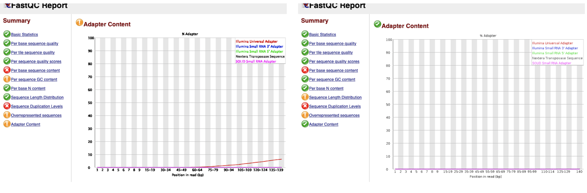

# Summary of Results

Here is a small summary of the results or advances that are generated during the project.

After generating the fastqc using [1.fastQC.sh](../bin/1.fastQC.sh) it was observed that the quality was good in general, however, some adapters were sequenced and these sequences can cause problems. To eliminate them and to improve the quality a little more, [2.trimmomatic.sh](../bin/2.trimmomatic.sh) was used and [1.fastQC.sh](../bin/1.fastQC.sh) to check that they had been eliminated correctly, you can see an example of a sequence in the following image:

  

Finally, a genome assembly was obtained following the workflow presented in this [repository](https://github.com/JavierUrban/Genome-assembly-of-the-copepod-Leptodiaptomus). Previously, there was a genome assembled with Canu that is not dated, but the comparison was made using [quast](../bin/quast.sh) and we observed that if these steps are followed, a more complete genome can be obtained, however the N50 is still small.

  

And in order to better evaluate the integrity of this genome, it was used [busco](../bin/busco.sh) selecting `arthropoda_odb9` as a database and the result is seen in the following graph.

  

Although the percentage of fragmented data is not large, the percentage of missing data, if it is, that is why it will be necessary to make an annotation of genes creating exclusive databases for copepods and check if this is the reason for the missing data or if it is must continue to improve the genome.